# SocioSync — System Workflow

This document explains the complete workflow of **SocioSync**, including user roles, complaint management, service assignment, status tracking, notifications, and feedback.

---

## 1. System Overview

SocioSync is a community service and maintenance management platform that connects **Residents, Mechanics, and Administrators** through a centralized complaint management system.

The core workflow is:

```text
Resident
   │
   │ Submit Complaint
   ▼
Complaint Created
   │
   ▼
Admin Reviews Complaint
   │
   │ Assign Mechanic
   ▼
Mechanic Receives Assignment
   │
   │ Update Status
   ▼
Work In Progress
   │
   │ Complete Service
   ▼
Complaint Resolved
   │
   ▼
Resident Provides Rating & Feedback
```

---

# 2. User Roles

SocioSync provides role-based access to three types of users.

| Role         | Main Responsibilities                                             |
| ------------ | ----------------------------------------------------------------- |
| **Resident** | Submit complaints, track progress, and provide service feedback   |
| **Mechanic** | View assigned complaints and update service status                |
| **Admin**    | Manage complaints, assign mechanics, and monitor service activity |

Each role has a dedicated dashboard and access to functionality relevant to its responsibilities.

---

# 3. Authentication & Role-Based Access

Users must authenticate before accessing their respective dashboards.

The application uses **JWT-based authentication** and role-based access control to ensure that users can only access features available to their assigned role.

### Authentication Flow

```text
User
 │
 ▼
Login / Registration
 │
 ▼
Credentials Verified
 │
 ▼
JWT Token Generated
 │
 ▼
Role Identified
 │
 ├───────────────┬────────────────┐
 ▼               ▼                ▼
Resident       Mechanic          Admin
Dashboard      Dashboard        Dashboard
```

### Login

Users enter their credentials through the login interface.

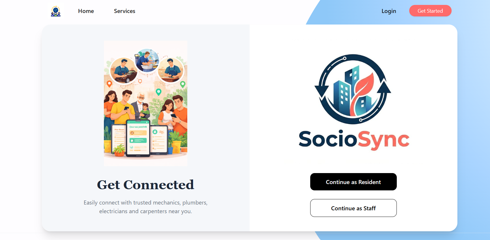

---

# 4. Resident Workflow

Residents are the primary users who submit and track maintenance or service complaints.

## 4.1 Resident Registration

A new resident can register an account by providing the required information.

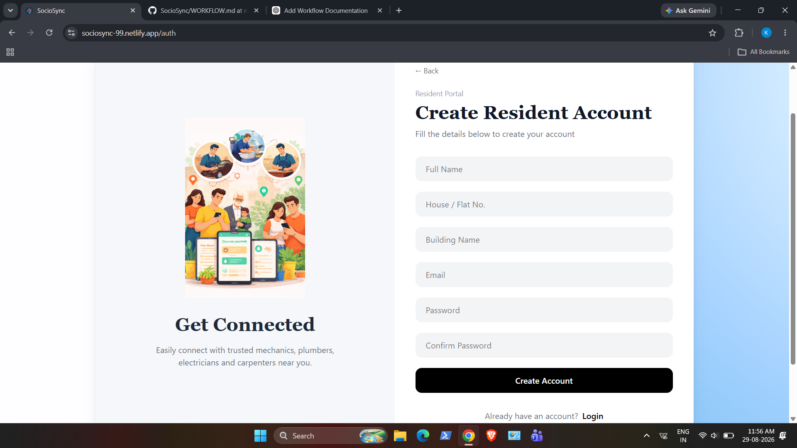

After successful registration, the resident can log in to the platform.

---

## 4.2 Resident Dashboard

After logging in, residents are directed to their dashboard.

The dashboard provides an overview of their complaints and their current statuses.

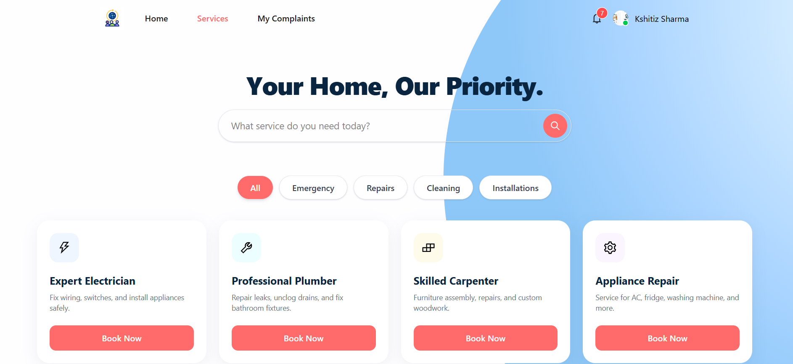

Residents can use the dashboard to:

* View submitted complaints
* Check complaint status
* Monitor ongoing services
* Access completed complaints
* View relevant notifications

---

## 4.3 Submit a Complaint

Residents can create a new complaint by providing the required service or maintenance information.

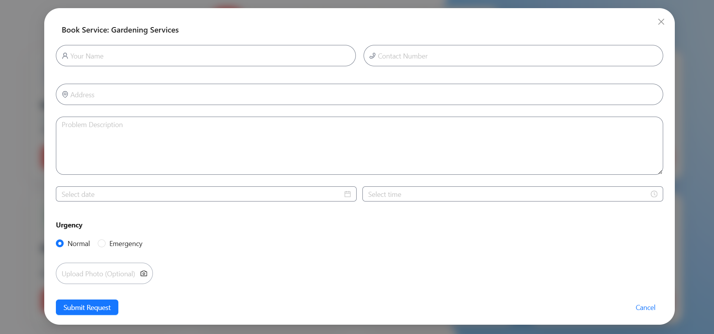

Once submitted, the complaint is stored in the system and becomes available for administrative review.

### Initial Status

```text
Complaint Created
       ↓
     Pending
```

---

## 4.4 Track Complaint

Residents can monitor the progress of their complaints from their dashboard.

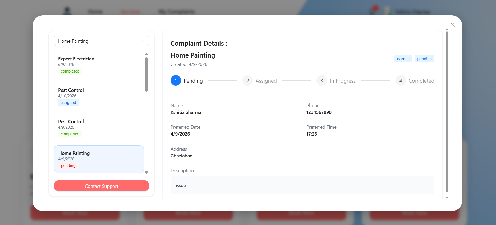

The complaint progresses through different stages depending on the actions performed by the Admin and Mechanic.

```text
Pending
   ↓
Assigned
   ↓
In Progress
   ↓
Resolved
```

---

## 4.5 Notifications

Residents receive notification updates when relevant changes occur to their complaints.

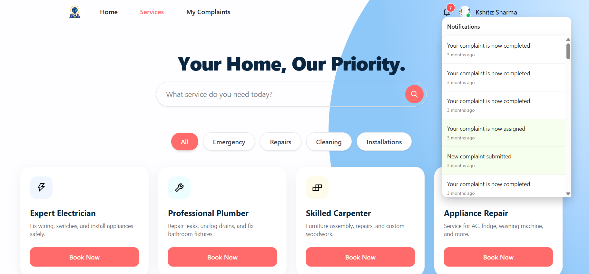

Notifications help residents stay informed about events such as:

* Complaint assignment
* Status changes
* Service completion
* Other relevant system updates

---

## 4.6 Rate Completed Service

After a complaint has been resolved, the resident can provide feedback and rate the completed service.

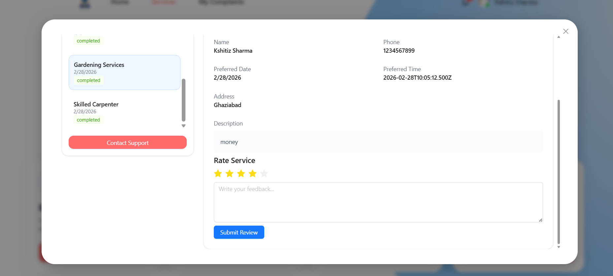

This allows the system to collect service-quality feedback and helps administrators and mechanics monitor service performance.

---

# 5. Admin Workflow

Administrators are responsible for managing complaints and coordinating service assignments.

## 5.1 Admin Dashboard

The Admin dashboard provides an overview of the platform's service activity.

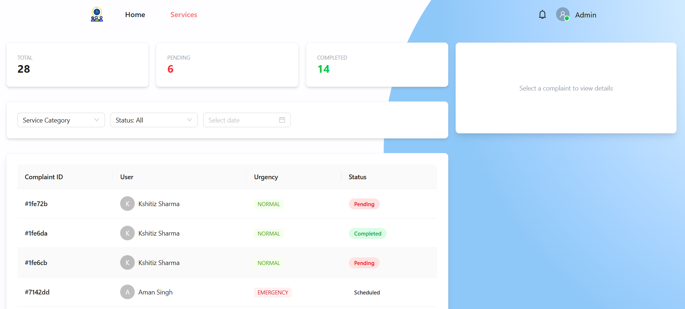

Administrators can monitor:

* Complaints
* Assignments
* Complaint statuses
* Service activity
* Feedback and ratings

---

## 5.2 Review Complaints

Administrators can view incoming complaints and inspect their details.

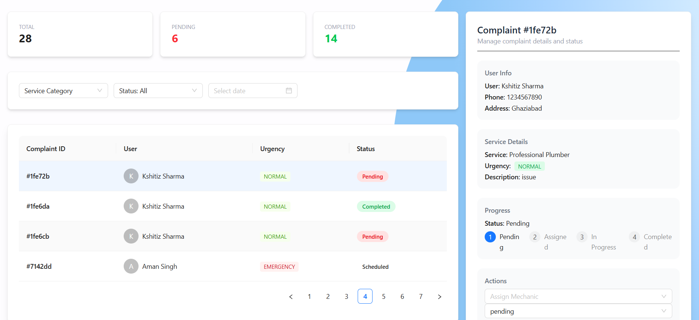

New complaints initially appear as pending and require administrative action.

```text
New Complaint
      ↓
Admin Review
      ↓
Assignment
```

---

## 5.3 Assign a Mechanic

After reviewing a complaint, the administrator can assign a suitable mechanic.

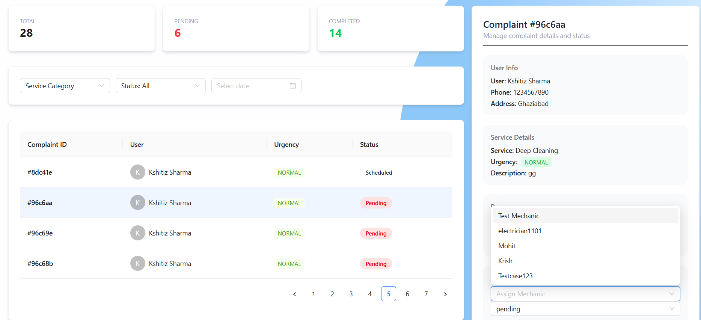

The assignment connects the complaint with the selected mechanic.

```text
Pending Complaint
       ↓
 Admin Assignment
       ↓
Assigned to Mechanic
```

The mechanic can then view the complaint from their dashboard.

---

## 5.4 Monitor Complaint Progress

Administrators can monitor complaints after assigning them to mechanics.

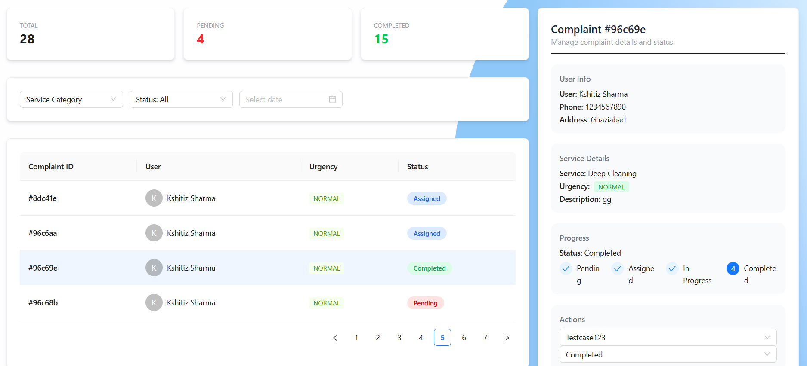

This allows administrators to keep track of the overall service workflow and identify complaints that may require attention.

---

# 6. Mechanic Workflow

Mechanics are responsible for handling complaints assigned to them and updating the progress of the service.

## 6.1 Mechanic Dashboard

After logging in, mechanics can view complaints assigned to them.

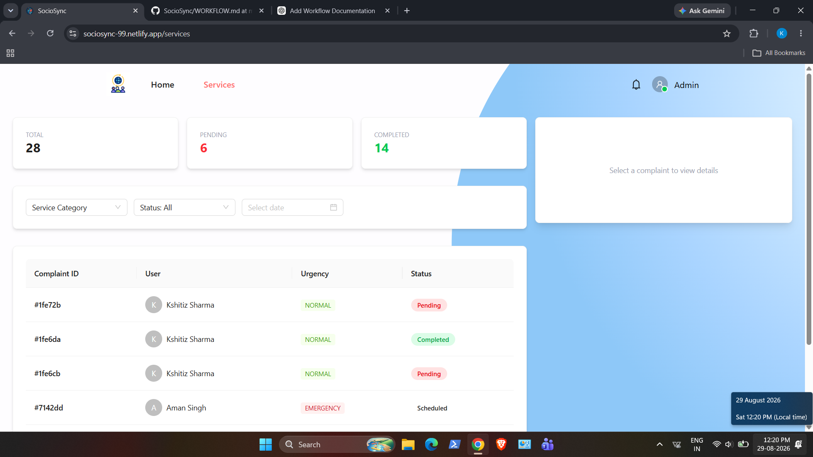

The dashboard allows mechanics to see relevant complaint information and monitor their assigned work.

---

## 6.2 View Assigned Complaint

Mechanics can open an assigned complaint to view its details.

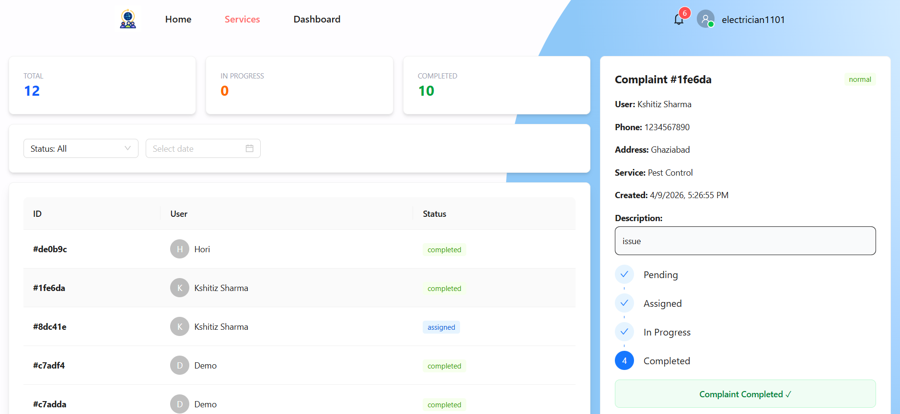

The complaint contains the information required for the mechanic to understand and complete the requested service.

---

## 6.3 Update Complaint Status

Mechanics update the complaint status as work progresses.

```text
Assigned
   ↓
In Progress
   ↓
Resolved
```

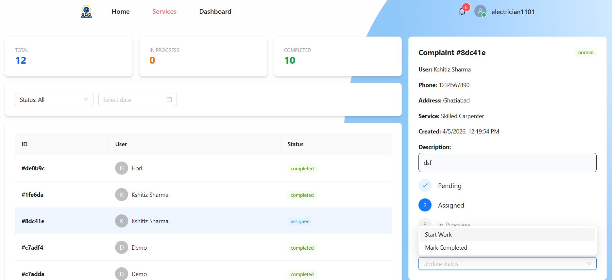

These status changes are reflected in the system and allow residents and administrators to track the progress of the complaint.

---

## 6.4 Complete the Service

Once the requested service has been completed, the mechanic marks the complaint as **Resolved**.

```text
Mechanic Completes Work
          ↓
       Resolved
          ↓
Resident Can Rate Service
```

The resident can then provide a rating and feedback for the completed service.

---

# 7. Complete Complaint Lifecycle

The complete complaint lifecycle connects all three user roles.

```text
┌─────────────────┐
│     Resident    │
└────────┬────────┘
         │
         │ Creates Complaint
         ▼
┌─────────────────┐
│     Pending     │
└────────┬────────┘
         │
         │ Admin Reviews
         ▼
┌─────────────────┐
│      Admin      │
└────────┬────────┘
         │
         │ Assigns Mechanic
         ▼
┌─────────────────┐
│     Assigned    │
└────────┬────────┘
         │
         │ Mechanic Starts Work
         ▼
┌─────────────────┐
│   In Progress   │
└────────┬────────┘
         │
         │ Mechanic Completes Service
         ▼
┌─────────────────┐
│     Resolved    │
└────────┬────────┘
         │
         │ Resident Provides Feedback
         ▼
┌─────────────────┐
│ Rating & Feedback│
└─────────────────┘
```

### Simplified Workflow

```text
Resident
   │
   └──► Create Complaint
              │
              ▼
           Pending
              │
              ▼
            Admin
              │
              └──► Assign Mechanic
                         │
                         ▼
                      Mechanic
                         │
                         └──► Update Status
                                  │
                                  ▼
                               Resolved
                                  │
                                  ▼
                               Resident
                                  │
                                  └──► Rating & Feedback
```

---

# 8. Complaint Status Flow

The complaint status represents the current stage of the service process.

| Status          | Description                                                           |
| --------------- | --------------------------------------------------------------------- |
| **Pending**     | Complaint has been submitted and is waiting for administrative action |
| **Assigned**    | Complaint has been assigned to a mechanic                             |
| **In Progress** | Mechanic is currently working on the complaint                        |
| **Resolved**    | Requested service has been completed                                  |

### Status Lifecycle

```text
Pending → Assigned → In Progress → Resolved
```

The status is updated as different users perform actions within the system.

---

# 9. Role-Based Feature Access

| Feature                  | Resident | Mechanic | Admin |
| ------------------------ | :------: | :------: | :---: |
| Register / Login         |     ✓    |     ✓    |   ✓   |
| Create Complaint         |     ✓    |     —    |   —   |
| View Own Complaints      |     ✓    |     —    |   —   |
| View Assigned Complaints |     —    |     ✓    |   ✓   |
| Update Complaint Status  |     —    |     ✓    |   ✓   |
| Assign Mechanic          |     —    |     —    |   ✓   |
| Monitor Complaints       |     ✓    |     ✓    |   ✓   |
| Rate Completed Service   |     ✓    |     —    |   —   |
| Submit Feedback          |     ✓    |     —    |   —   |
| View Ratings / Feedback  |     —    |     ✓    |   ✓   |
| Notifications            |     ✓    |     ✓    |   ✓   |
| Complaint Filtering      |     ✓    |     ✓    |   ✓   |

---

# 10. Complaint Filtering

SocioSync provides filtering functionality to help users quickly locate relevant complaints.

Complaints can be filtered using available criteria such as:

* Complaint status
* Date
* Other relevant attributes


Filtering helps administrators and users efficiently navigate larger numbers of complaints.

---

# 11. Notification Workflow

Notifications keep users informed when important events occur.

```text
Complaint Created
       │
       ▼
  System Event
       │
       ▼
Notification Generated
       │
       ▼
Relevant User
```

For example:

```text
Admin Assigns Mechanic
        ↓
Notification
        ↓
Mechanic
```

and:

```text
Mechanic Updates Status
        ↓
Notification
        ↓
Resident
```


---

# 12. Service Rating & Feedback Workflow

Once a complaint has been resolved, the resident can provide feedback.

```text
Complaint Resolved
        ↓
Resident Reviews Service
        ↓
Rating Submitted
        ↓
Feedback Stored
        ↓
Admin / Mechanic Can Review
```


The rating and feedback system provides a way to evaluate the quality of completed services.

---

# 13. High-Level System Architecture

SocioSync follows a MERN-based full-stack architecture.

```text
┌─────────────────────────────────┐
│          React Frontend         │
│                                 │
│  React Router                   │
│  Tailwind CSS                   │
│  Ant Design                     │
│  Axios                          │
└───────────────┬─────────────────┘
                │
                │ HTTP / API Requests
                ▼
┌─────────────────────────────────┐
│        Node.js + Express        │
│                                 │
│  REST API                       │
│  JWT Authentication             │
│  Role-Based Authorization       │
│  Complaint Management           │
└───────────────┬─────────────────┘
                │
                │ Mongoose
                ▼
┌─────────────────────────────────┐
│          MongoDB Atlas          │
│                                 │
│  Users                          │
│  Complaints                     │
│  Assignments                    │
│  Ratings / Feedback             │
│  Notifications                  │
└─────────────────────────────────┘
```

---

# 14. End-to-End Example

The following example demonstrates how a typical complaint moves through the system.

### Step 1 — Resident

A resident notices a maintenance issue and submits a complaint.

```text
Resident → Create Complaint
```

The complaint is created with the status:

```text
Pending
```

---

### Step 2 — Admin

The administrator reviews the complaint and assigns a mechanic.

```text
Admin → Review Complaint → Assign Mechanic
```

The complaint status becomes:

```text
Assigned
```

---

### Step 3 — Mechanic

The assigned mechanic views the complaint and begins working on it.

```text
Mechanic → View Assignment → Start Work
```

The status becomes:

```text
In Progress
```

---

### Step 4 — Service Completion

After completing the requested maintenance work, the mechanic marks the complaint as resolved.

```text
Mechanic → Complete Service
```

The status becomes:

```text
Resolved
```

---

### Step 5 — Resident Feedback

The resident is now able to review the completed service and provide a rating and feedback.

```text
Resident → Rate Service → Submit Feedback
```

---

### Final Workflow

```text
┌──────────┐
│ Resident │
└────┬─────┘
     │
     │ Submit Complaint
     ▼
┌──────────┐
│ Pending  │
└────┬─────┘
     │
     │ Admin Assigns
     ▼
┌──────────┐
│ Assigned │
└────┬─────┘
     │
     │ Mechanic Starts Work
     ▼
┌─────────────┐
│ In Progress │
└──────┬──────┘
       │
       │ Service Completed
       ▼
┌──────────┐
│ Resolved │
└────┬─────┘
     │
     │ Resident Reviews
     ▼
┌──────────────────┐
│ Rating & Feedback│
└──────────────────┘
```

---

# 15. Project Screenshots

The following screenshots demonstrate the major interfaces and workflows available in SocioSync.

### Resident


### Admin


### Mechanic


### Complaint Management


### Service Rating


---

## Conclusion

SocioSync provides a centralized workflow for managing community maintenance and service requests.

The system connects:

**Residents → Administrators → Mechanics → Service Completion → Resident Feedback**

Through role-based dashboards, complaint tracking, status management, notifications, filtering, and service ratings, SocioSync provides a structured workflow for managing the complete lifecycle of a service request.
